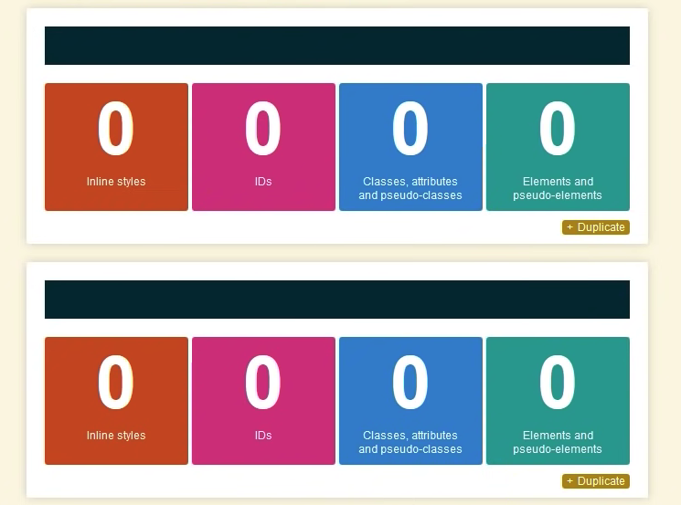

# CSS ADVANCED
### css specificity

`!important` keyword means ignore any other CSS, apply this instead. 

classes are considered more specific than tags 

***inline styles almost always win.*** except when the !important is used. it will overwrite it.

inline styles --> ids --> classes, attributes, pseudo-classes --> elements and pseudo-elements.

attribute selector 

;

use classes also with p mosdef if you want to style them seperately.
and easyily to used across multiple pages like class="title"

### classes 
- adding more classes to an element.

### Combining CSS class and element selectors

tagname.classname to target the class in the element. 

>
>` p.warning {
>
> color: red;
>}`
>

what it basically says here above is. Target all `
` tags that have the `class="warning"`

### Descendant combinator

- descendant means afstammeling
- who are their parents? 
- space is descendant selectors

`div span {
  color:red;
}`

will match all `` elements that are inside a `
` element.

## PSEUDO-CLASSIC
- : colon. pseudo classes are used to style the state. 
- :hover doesn't work on mobile phones
- a:focus (is bijvoorbeeld als de clients door de links tabt)

the browser calculates a specificity rules. 

## CSS WIDTH , HEIGHT, OVERFLOW

`
` a div takes up the 100% width of the page
The default value of `overflow` is visible. (values: hidden, auto - adding scrollbars - )
overlow-y / overflow-x to control the scrollbars

# ADVANCED CSS SELECTORS
<!-- ============================
UNIVERSAL ====================== -->

**universal selector (*)**
usually use this to reset things. 

`* { 
  selects everythings except ::before and ::after;
}`

- if you want to add it add it to universal selector 
*, *::before, *::after 
{
  box-sizing: border-box;
  margin-top: 0;
}

and also p *  { 
  font-style:italic;

}

selects all the p tags

**direct childern (>)**
.direct-children > p 
so targets the p-tag that are DIRECT children from .direct-children
so ONE indent away.

**adjacent sibling (+)**

THE ONE BEFORE IT HAS TO BE THAT SELECTOR

`.adjancent-sibling .box + .box {
  background: red;
}`

there has to be a box before me before i change to background:red.

**general sibling(~)**

ANYTHING BEFORE IT HAS TO BE THAT SELECTOR
 the (~) selects siblings.

`.adjancent-sibling .box ~ .box {
  background: red;
}`

**attribute selector []** 
- selects all elements that have the given attribute. 
- all attribute selectors are with the square brackets
- you usually see this on inputs or links

`[attr]`

`a[target] {
  color: darkblue
}`

` a[href="aboutme.html"] {
  color:red
}`
so only the a href liks with the aboutme path will turn red

a[class|="another"] {color: purple}

the | means all classes that starts with "another" 

a[href^="http"] {
  color:orange;
} this one is a lot more forgiving

 

a[href*="google"] {
  color:red; 
}

it * will get anything that has google in it or any part of the word.

a[href$=".ca"] {
  color:blue 
}

looking for the end of the attribute in this case the .ca in the ``

[youtube: Kevin Powell- Selectors and Combinators](https://www.youtube.com/watch?v=Bcr70LIJcOk&ab_channel=KevinPowell)

URL vooral einde is handig met de ::after icoon die je kunt plaatsen bij bijvoorbeeld een link tag, door het gebruik van attribute selectors and pseudo classes. 

## PSEUDO ELEMENTS:

`p::first-line { 
  color: hotpink;

}` 

this pseudo element targets the first line of every `
` as if there was a ``

 

# CSS POSITIONING

block elements takes up the whole width but the height is dependent on the height of the content itself.

children are sit on parents. there are layers : z-index. that is how it gets rendered via HTML.

there is a : x axis | y axis | z axis

## Position
- static (default)
- Relative
- Absolute
- Fixed 

**relative positioning** doesnt affect any other element on screen. it doesn't e.g pushes other elements down up left or right and etc. Relative to its previous positioning. 

- doesn't affect the flow of the document. 
- you are adding a margin relative to where the element should have been 

**absolute positioning**  
positioning the element relatively to its parent. so it moves within the parent if you set the child position: absolute. 

- adding a margin within it's parent element.
- does affect the flow of the document. 
- if you don't set a parent element on relative it will be take the body as relative. 

### coordinates 
-top
-bottom
-left
-right

## UNITS
if you use pixels in CSS it may not fit your visitor's screen. In most cases you'll want relative unit. 

vw / vh , the viewport is that part of your webpage that is currently visible in the window. if you want your header element to have the exact height of the viewport, set it like this

` header { 
  height: 100vh;
}` 

regardless of your display your header will always take up 100% of the height of the visible screen. same goes for vw.

<!-- ======== SETTING IT IN MEDIAQUERIES DURING BREAKPOINT =========  -->
:root {

  font-size: 80%;
}

## TRANSFORM

## OVERFLOW
if you want to cut something off. overflow property only works on a block element and when it has a defined height. 

