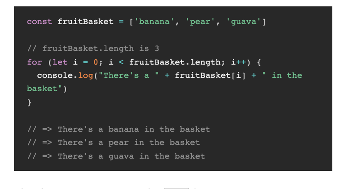

# LOOPS

Loops are control structures/ control flows just like if else statement.

- automate repetitive tasks untill we tell it to stop

repeats parts of code for you so you dont have to repeat yourself.
it will check a certain condition for you and aslong that condition is valid it will keep iterating.

## While Loops

for the while loop we can only specify a conditon.

it will run WHILE this condition is true;

for the while loop we can only specify a condition.
it will run WHILE this condition is true

The while loop is more versatile because you don't have to specify a counter it only needs a condition. sometimes that is what we needed when its not depended on a counter.

if you need a loop without a counter then use while. If you don't know how many iterations you need. e.g how many times to roll a dice to get a 6.

when you loop over an array then you usually use a for loop since you know how many iterations you need.

## BREAK KEYWORD

break keyword is normally used with while loop to escape a loop. because we don't know how many times we need to do the iteration

**dictionary**
iterate = herhalen

## For Loops

for statement
for loops has a counter.
for loops keeps running while the condition is true.

first part --> initialization the counter of the loop / so the starting point;
second part --> condition; will keep running if the condition still holds true.
third part --> counter ; rep = rep + 1 --> rep++ (same shorthand)
i = i + 1 --> i++ (shorthand)

- you can call the variable anything you want this variable will only exist for the purpose of the loop. it doesn't do anything with code elsewhere in the code. it's common to use i. Colt says its perhaps for index.

syntax:

for (initialExpession; condition(boolean true or false); incrementExpression) {
statement
}

> `for (let i = 0; i < 10; i++)`
>
> `{`
>
> `bounceball();` // statement
>
> ` }`

before you loop, you need to have a statement. this statement is the block of code you'd like to run multiple times. you can write anything you want here, even functions.

This condition statement evaluates either to true or false. If the statement evaluates to true, the statement runs.

When the statement has ran, JavaScript runs the increment expression and checks if the condition evaluates to true again. It repeats this process until the condition evaluates to false.

Once the condition evaluates to false, JavaScript skips the loop and moves on with the rest of your code

# Infinite loops

inifinite loops occur when the condition for your 'for' loops always return true.

# Looping through arrays

In practice you'd always loop through an array of a object.
When you loop (or iterate) through an array, you go through each item in the array once. To do so, you can use the length or the array as a condition: see example below

alternative way to write for loop using negative increment, so a decremenent.

## For of loops : looping through arrays with 'for.... of'

The for...of loop is preferable to the standard for loop because it always loops through the array once. There’s no need to write array.length, which makes your code much easier to read and maintain.

for .. of loops are especially good if you need to iterate over an array but you don't need to know the index of the array. IF you do need to know the index then it's better to use the for loop instead of for..of loop.

you can also use it for ' strings'

## object literals Looping

object literal (key value) is actually not iterable.

when we want to loop over object we can use
for .. in loops

it will only give you the key

# SCOPES

global scope : is a variable that is declared in the root of the file and can be used whevere we want in de Document.

# New style : array methods that iterate over an Array

Every array in JavaScript has these built-in functions that iterate over that array. The different array methods do different things, but they all iterate over an array.

The forEach() method executes a provided function once for each array element.

forEach:

(method) Array<string>.forEach(callbackfn: (value: string, index: number, array: string[]) => void, thisArg?: any): void

there is no way to stop or break a forEach( loop, then its better to use for loops.

## FOR.. OF AND FOR...IN

you can use both on objects

for .. of loops through values
for ...in loops through properties

for...of - Use to loop over strings and arrays.
for...in - Use to loop over objects.

## forEach

The forEach method is also used to loop through arrays, but it uses a function differently than the classic "for loop".

The forEach method passes a callback function for each element of an array together with the following parameters:

- Current Value (required) - The value of the current array element
- Index (optional) - The current element's index number
- Array (optional) - The array object to which the current element belongs

The forEach() method executes a function once for each item in the array. The method is called on the array object that you wish to manipulate, and the function to call is provided as an argument.

Array forEach methpd

names.forEach(function(currentValue,index, array(optional))) {
console.log(e,i)
}

example:: 

> ` numbers.forEach((number, index, array) => {`
>
> ` console.log(array);`
>
> `});`

## SPREAD OPERATOR

...(ArrayName)

So what the spread operator does is to basically take all the values
out of this arr. array, and then write them individually. its like taking all the elements out of the array and write them manually

# Arrays (NIELS BLOM 29-07-2021)
arrays is een ingebouwde datastructure = gestructureerde data

lijst van dingen (kan cijfer zijn, boolean, object maar ook lijsten van lijsten). 

in een array kan je alles stoppen (heterogeneous), maar meestal doe je meestal dezelfde items in de lijst.

- the things are always ordered in an array
- in JS we can add and replace all over the array. read, update and delete.

## LOOPING 
doing something repeatedly; dus iets herhaaldelijk doen; iets wat je meerdere keren wilt doen. 
-for loop
-forEach // meest gebruikt maar je moet wel functies gebruiken
-while

- we can use loops without arrays
we can use arrays without loops
- we can use arrays and loops together

### ITERATING OVER THINGS THAT ARE NOT ARRAYS
things we can interate over are called 'iterable objects". je kan dus over mijn loopen. those objects basically tell the world 'hey you can interate over me'.

Arrays are also interable objects.

when we have a 'iterable object' we can use **for .. of**

***methods to iterate over objects***
 for ... of

 for ... in 

