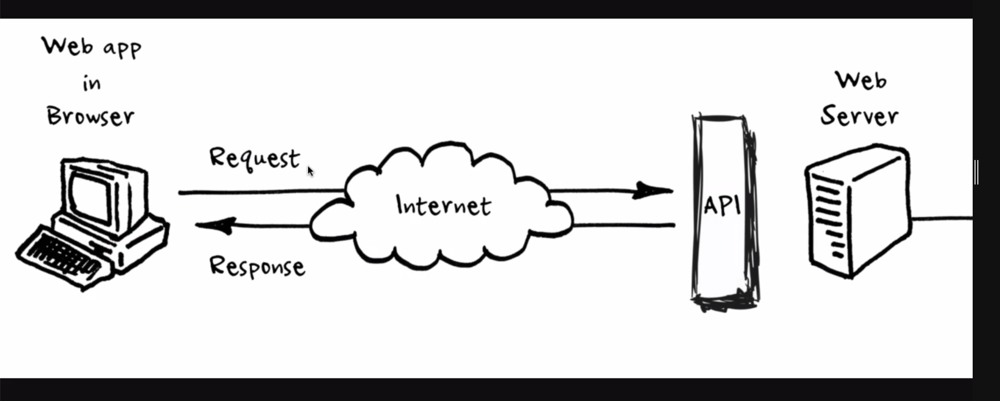

#  COMMAND LINE INTERFACE (CLI) 

CLI is older than GUIs
most operating system still have them (exceptions are iOS and android (not sure))

Non-OS command line interface (non operating system)
-console in browser
-programming language REPLs
these are CLI's but they are not operating system CLI's

console is sort of a terminal

**shell**
zsh (shell)
the software running inside of a terminal thta allows you to interact with the operating system (OS).
you can run different shells on a terminal

- powershell
- zsh
- bash
- fish

inside the terminal runs a shell. most people choose a shell that they like. you can set that by default.

**prompt**
the characters before the cursor on each new command line. the default prompt will be different per shell and can be configured.
you can change (configure) the prompt from a shell if you want.

**REPL**

the command line for a programming language::

-read
-evaluate
-print
-loop (go back accepting a new command)

### Tips commands in terminal

if you delete something in de CLI then it will be possible you will really delete something and wont be able to get it back.

commands:

_arrow up_

- reuse your old command

_history_

- history command you get history form the commands. it works different on all shells and OS.

**autocompletion**
tab
e.g. cp an(tabcommand) and the name of the file will be autocompleted

**kind of termainal applications on macOS**

- built-in terminal
- macOS:iTerm2 >> is very customazible
- Hyper

**where am I ?**
pwd (print working directory command)

**clear the screen**
clear

**look around the folder**
ls

ls -l
(to get a nicer formatted list of the folders and files)
if it starts with a d (e.g drwxr-xr) it means its a directory

**go somewhere else**
cd (change directory)
cd .. (go up on directory)

. is an alias for the current directory
.. is an alias for the parent directory

### directory command

- create a directory
  mkdir (make directory)
  e.g mkdir project3 and look in ls you will see a project3 directory is created

- delete a directory
  rmdir (remove directory)
  the rmdir will only remove empty directories. SO not one with something in it.

### files command

- delete a file
  rm (remove)

- creating a file
  touch
  e.g touch todo.md

## copy files

cp (de huidige file naam) (nieuwe naam van copy)

## file openen

open (filenaam)

## rename a file

mv

# run javascript on Terminal

node script.js (wel eerst naar de juiste directory gaan) zowel in de macos terminal als vscode terminal

## VSCode

first select the folder/file
code . (it means open vscode)

## Node js

- it's a JS Runtime
- built on the V8 Javascript engine, same as google chrome
- essentially let us run javascript code on the server
- you can use node.js to get interaction with the computer e.g making desktop applications
  without node js. it will just be locked in the browser. it will happen in the server instead of on the client side.

Node js is a runtime not a programmer language.

# mathematical operators

#  Javascript 

JavaScript is a loosely typed and dynamic language. Variables in JavaScript are not directly associated with any particular value type, and any variable can be assigned (and re-assigned) values of all types:

we use javascript to add behaviour

difference between javascript and ecma script

statement is a piece of code that expresses an action that needs to be carried out. alle js code should be terminated by semicolon ;

**seperation of concerns**

seperate our HTML (content)
from Javascript (behaviour)

**variables**

let name;
see the variable as a box.
variables with no value will have the outcome 'undefined'

**_naming rules_**

- always use meaningful and descriptive names
- they cannot start with a number
- they cannot contain a space or a hyphen (-)
- camelnotation: firstName (so first words lowercase and second word start with uppercase)

- If you don't need to reassign Use 'const'. Otherwise use 'let'

reserved keywords

- if
- let  
  vscode will sign you that this is not available they will have red dotted underline.

## PRIMITIVE TYPES

what are the kind of values that we can assign to variables?

we have: primitive types AND reference types

primitive datatypes

- Booleans : can only have the values true OR false like subscribed or not subscribed. 

Boolean conditionals are often used to decide which sections of code to execute (such as in if statements) or repeat (such as in for loops).

- Null : when you explicitely clear the value of a variable
  null is not as "primitive" as it first seems! Every Object is derived from null value, and therefore typeof operator returns object for it:

> tyoeof null === 'object'  
> (true)

- undefined : if you don't initialize a value it will be undefined. A variable that has not been assigned a value has the value undefined
  undefined is a primitive value automatically assigned to variables that have just been declared, or to formal arguments for which there are no actual arguments.

- numbers (bigInt, numeric, NaN)
- string
  a string is a sequence of characters used to represent text.

- Big and symbol

**NaN**
0/0 output is NaN\
NaN \* 12 outout is NaN

typeof NaN --> output number type

## truth-y & false-y values
all js values have an inherent truthyness or falsyness about them
- falsy values: 
-false
-0
-"" (empty strint)
-null
-undefined
-Nan (but the type is number. NaN is just an invalid number)

- everything else is Truthy! 

### Dynamic typing (js is a dynamic language)

typeof (to check the typeof the variable). type of the value.

undefined is a Type but also a Value.
typeof null is a object unlike undefined

# OPERATORS

## Arithmetic Operators

Arithmetic operators are used to perform arithmetic between variables and/or values.

we can use the + operator to concatenate strings

**increment**

prefix
postfix

x++ returns the value before incrementing when calling the variable it will be incremented
++x returns the value after incrementing when calling the variable the value is the same

**decrement**
x-- returns the value before decrementing when calling the variable it will be incremented
--x returns the value after decrementing when calling the variable the value is the same

## Objects

The values are written as name:value pairs (name and value separated by a colon).

## Arrays

- arrays zijn objects ; objecten zijn altijd true als je naar hun truthiness kijkt.
- you can equip properties/eigenschappen like (arrayvariable.length)

## precedence

javascript has a operator precedence. operator precedence determines the order in which operators are evaluated. operators with higher precedence are evaluated first.

![link mdn precedence] (https://developer.mozilla.org/en-US/docs/Web/JavaScript/Reference/Operators/Operator_Precedence)

use parantheses (2 + 900) / 2 to get a operator executed first. de grouping operator (...) has the highest precedence

## BEDMAS

B brackets
E exponents
D division
M multiplication
A addition
S ubstraction

> +=
> you can also use this with strings
> e.g
> let str = "hi";
>
> str+="hi"
>
> output : hihi

# constructor

all constructor functions , with the exception of function constructor will always be the typeof 'object'.

> let str = new String ("String");
>
> typeof str;
>
> output will be 'object'

##  API'S LIVE LES 

**door stijn**

API is een algemeen term de invulling kan anders zijn en kan verschillende regels hebben.

api is een interface dus een contact tussen jou en het systeem.
api biedt jouw ingang tot een systeem zoner dat ze echt jouw systeem hoeven te programmeren. een versimpeling van jouw systeem om ermee om te gaan. zonder een api kan je niet met een ander systeem omgaan.

api's allow you to write code that talks to systems.
zoals een weather app. jij bouwt een systeem die met jou kunnen praten.
zoals sociale media platormd twitter, fb, lampen, smart speakers and cars etc.

All api's are everywhere but not all api's are web api's.

Je kunt bijvoorbeeld API's werken die de voorraad bijhoudt en aan jouw klanten kan laten zien.

ecosysteem. dus bijvoorbeeld twitter en de data ervan gebruiken.

internal automatisation:
intern ook allemaal processen automatiseren.
AWS

**terminology whirlwind:**

- CRUD: Create, Read, Update, Delete
- REST: manieren om API's te schrijven, dus niet de programmertaal maar meer de regels net zoals SOAP. REST heeft iets minder zware regels dan SOAP.
- SOAP
- GraphQL: specificeer je eerst welke data je wilt.
- JSON : soort van javascript object en manier om js te structureren en om te sturen tussen de server en de browser. het is een datastructuur
- XML : manier om data te structureren

### Systeem achter de API

je vraagt iets en je krijgt iets terug. this can be everything. But the technology behind the API should not matter the most of the time.
API's zijn voornamelijk in de backend.

POST request staat voor CREATE in CRUD.
de api herkent de POST request en de waarde doorgeven en opslaan in het systeem. de api herkent het. en api structureren hoe zij dat willen.

delete request NOG IN ZOOM

## les two over JS asynchroom

javascript is synchroom en je kunt hieruit brekegen door async te gebruiken.
JS is a single threaded block element

**function execution stack (aka call stack)**
functies staan op de callstack
ziet eruit als een to do list.
functie 1 roept tie aan voert tie uit en gaat daar naar de volgende
op die manier is js synchroom dus een voor een alle acties af.

asynchrone js. wat is het en waar gebruik je het voor?

synchrone code blokkeert. een voor een
asynchroom: betekent niet gebeurend tegelijkertijd.
e.g. data fetchen, liever niet wachten

## browser api's

extensie van normale browser /JS / code
maakt complexe code simpel

## promises

promise may be one of 3 possible states
promise is a javascript object die mogelijk een waarde gaat produceren in de toekomst.

-fulfilled
-rejected
-or pending

promise.then =>
.then om te vertellen wat je er moet gebeuren als de waarde terugkomt.

# Objects

- objecten zin Key-Value pairs
- are heterogeneous
- dataset die het makkelijk maakt om data te structuren.
- key value pairs. met een object kun je een key en een value pairs geven dat kan met een array niet. dan moet je onthouden wat een bepaalde value is.
- objecten zijn niet perse geordend (dit kan te maken hebben met performance), arrays hebben wel een vaste volgorde.

values can be anything

- string
- number
- boolean
- array
- object
- functions (often called a method then)

objects are 'passed by reference' 

# IF statements

to check if some conditions are met or not. always checks if the condition is true

using `else if (condition) {     }` in order to check another condition or multiple conditions.
ends with `else { }` 

## comparison operators 
`===`
`==`
`>=`
`<=`
 `>`
 `<`
 !==
!=== negation operator

### logical operators
In JavaScript, the logical operators are used to combine two or more conditions

&& AND
|| OR
! = 	! is known as NOT operator. It reverses the boolean result of the operand (or condition). !false returns true, and !true returns false.

## stringmethods
***syntax***
thing.method() --> you have to add the paranthese, so that js knows that this is a method.

## Ternary Operator
 syntax `<condition> ? <true : <false>;`

 
## Type Conversion and Coercion (jonas udemy)

