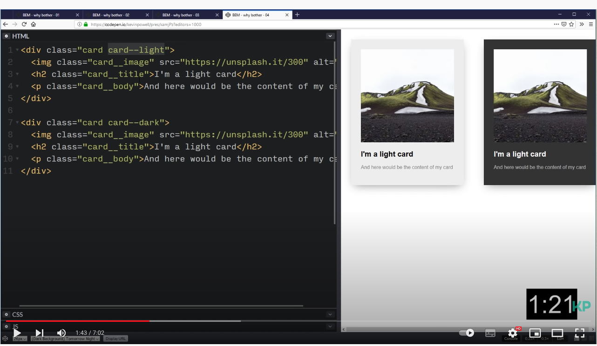

# SASS
**Syntactically Awesome Stylesheets**
### conventions (rules/agreements)

A naming convention is a rule whereby everyone agrees to name certain things in a certain way. e.g. CSS doesn't use cammelCase.

# Naming 
This is a method that consists of naming your CSS classes based on the role they play in your HTML. the BEM (block - element - modifier)  approach ensures that everyone who particopates in the development of a website works with a single codebase and speaks the same language. Using proper naming will prepare you for the changes in design of the website. 

class="card" --> BLOCK  
class="card__image"--> is element (so it's inside something). double underscore __
class="card--light" --> modifyer. double hyphen --

- Block: We can look at the block as the container of the nested elements we will style within it. An un-ordered list `<ul> `with the class of menu, for example.
- Element: The list items `<li>` contained within the menu class as children are our elements, we may give them a class of menu__item.
- Modifier: Now let’s imagine one of the list items (or links in the menu) are disabled or are on an “active” status because we are on that page. Those would be our modifiers, .disabled and .active. Anything without the modifier is just the default for that element. The class for our modifier could be .menu__item--active.  

*To select the block we give it a class name. To select the children we separate it with double underscore __. And if we have a modifier we add it with a double dash -- in front of it: block__element--modifier.*

**pre-compiler/pre-processor**
A pre-compiler/pre-processor is a program that processes it's input data to produce output that is used as input to another program. 

the .scss file get pre-compiled to a regular .css file. in the end, it get turned into a regular .css file. All Sass gets transformed to a single CSS file. The browser won't know the difference, but you as a programmer get to work much more efficiently.

**Advantages of Sass**
-Nesting selectors
-Modules (importing and exporting different files)
-Variables ($element)
-& element
## Advanced Sass advantages
-Mixins
-Extend
-Calculations

### Sass with dev ed.

**variables** STORING ONE PROPERTIES AND VALUE

Variables declared at the top level of a stylesheet are global. This means that they can be accessed anywhere in their module after they’ve been declared. But that’s not true for all variables. Those declared in blocks (curly braces in SCSS or indented code in Sass) are usually local, and can only be accessed within the block they were declared.

* you make variables with `$primaryBtn: #fff`

`$` by starting it with a dollarsign.

* Add a pseudoclass or element. 
    

`<variable> :<expression>`
variables can be used anywhere you want. 

>
>`&::after {
>content:"hello"
>}`
>

## Mixins 
* STORING MORE PROPERTIES AND VALUES -- ALSO ARGUMENTS/PARAMETERS.

Mixins allow you to define styles that can be re-used throughout your stylesheet. They make it easy to avoid using non-semantic classes like .float-left, and to distribute collections of styles in libraries.

*syntax* 
>
>@mixin <name> {
>
>}
> or
>
>@mixin name(<argument>) {
> }
>
>

## Extensions

@extend
you can overwrite it just by adding css properties and values.

## Partials 

@import "colors" 

